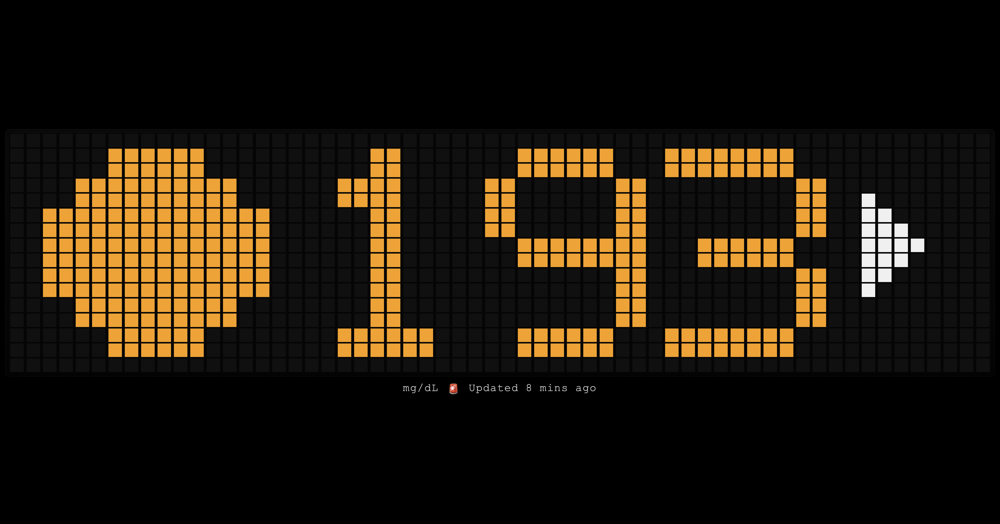

# Sugar Display (Nightscout)

Simple fullscreen glucose display for an old iPad desk screen.



## Features
- Pixel-like large display
- Left emoji status icon
- Trend arrow + glucose value from Nightscout
- Configurable thresholds and emoji logic
- Configurable colors (background/system/alerts)
- Docker deployment

## Configure
Edit `config.js`:
- `useProxy`: keep `true` (recommended for iPad/CORS reliability)
- `apiPath`: keep `/nightscout/api/v1/entries.json?count=1` when `useProxy=true`
- `nightscoutBaseUrl`: only needed if `useProxy=false`
- `targetLow` / `targetHigh`: thresholds (default `70`, `180`)
- `emojis`: icon per status (`ok`, `low`, `high`, `stale`, `error`)
- `emojiRanges`: optional range-based custom emoji overrides
- `colors`: `background`, `system`, `low`, `high`

Set your Nightscout upstream URL in `.env`:
```bash
cp .env.example .env
```
Then edit `.env` and set:
```bash
NIGHTSCOUT_UPSTREAM=https://your-nightscout-host
NIGHTSCOUT_API_SECRET=your-api-secret-or-sha1
```

If Nightscout still returns `401 Unauthorized`, use SHA1 of your API secret:
```bash
echo -n 'your-api-secret' | sha1sum
```
Then put the 40-char hash into `NIGHTSCOUT_API_SECRET`.

## Run with Docker
```bash
docker compose up -d --build
```

Open:
- `http://<server-ip>:8080`

On iPad (Safari):
1. Open URL
2. Share -> Add to Home Screen
3. Launch from Home Screen for fullscreen feel
4. (Optional) Settings -> Display & Brightness -> Auto-Lock -> Never

## Notes
- Proxy mode (`useProxy=true`) avoids browser CORS problems by routing through this server.
- If the data is older than `staleMinutes`, emoji switches to stale state.
